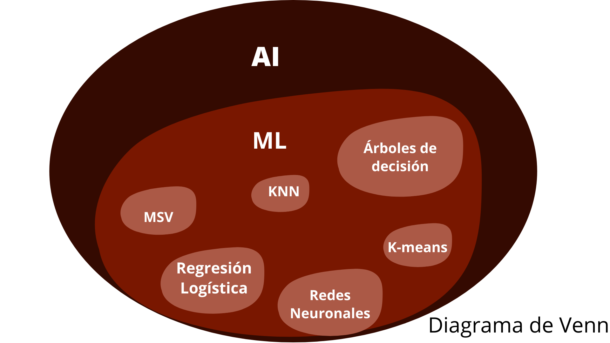

# Arboles de decisión

## Introducción
### Para conezar a hablar acerca de los Arboles de Decision primero debemos definir que es el Machine Learning (ML) o Aprendizaje Automatico. 
#### El ML es una rama de la Inteligencia Artificial (AI) que busca a través de un conjunto de algoritmos y técnicas basadas en modelos matemáticos logren aprender a partir de datos a resolver una tarea en específico - Antonio Gulli y Pal Sujit, 2017-

Debido a que muchas personas se suelen confundir con estos terminos cree un Diagrama de Venn que ilustra la diferencia entre cada uno de estos:

#### Ahora que sabes la diferencia entre ML e AI es preciso definir los arboles de decisión como sigue: son un tipo de algoritmo no parametrico dentro del campo del ML usado para resolver tareas de Regresión y Clasificación. 

## Objetivo
El objetivo es crear un modelo que prediga el valor de una instancia o vector aprendiendo ciertas reglas de decisión inferidas a partir de ejemplos de instancias etiquetadas. A este tipo de tarea de aprendizaje se conoce como Aprendizaje Supervisado

El conjunto de datos es dividido en dos subconjuntos principales, los datos de entrenamiento y de prueba.
Para algunos conjuntos de datos es necesario aplicar técnicas de preprocesamiento como la discretizaci\'on.
 
